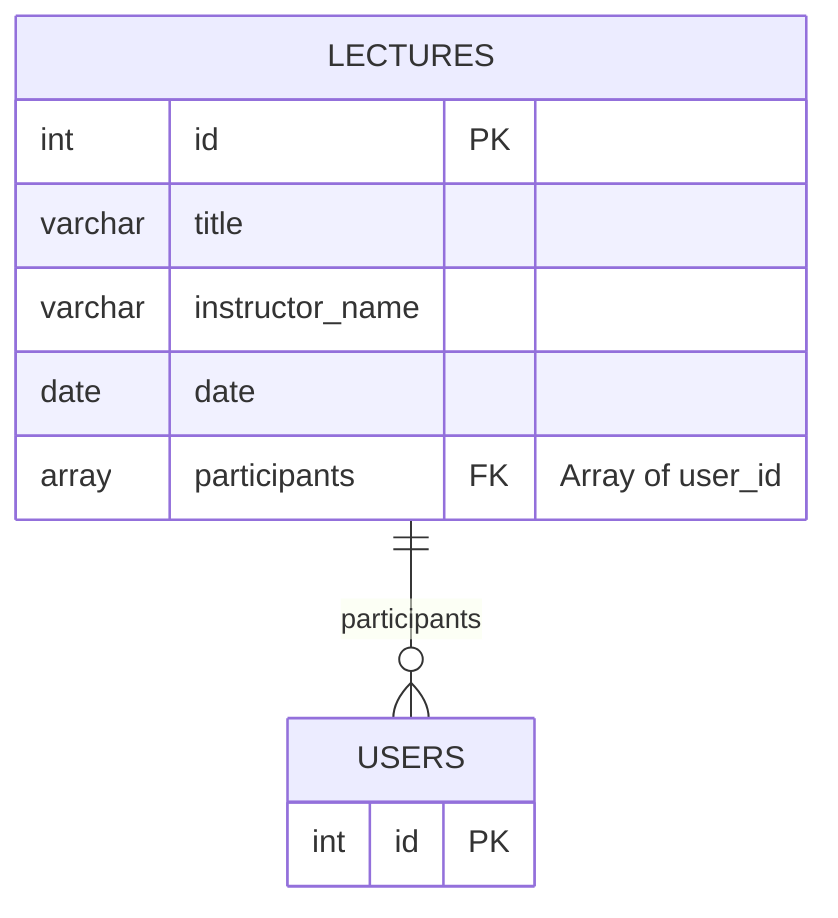

# 특강 신청 서비스

이 프로젝트는 **특강 신청 서비스**를 구현한 예제입니다. 아래 내용을 포함합니다:

- ERD 설계
- Clean + Layered Architecture 구현 이유와 설계
- 과제 진행 시 설정한 제약 조건
- Docker Compose를 활용한 MariaDB 실행
- 테스트 시도 및 결과

---

## **ERD**

아래는 프로젝트의 데이터베이스 설계를 나타내는 ERD입니다.



---

## **아키텍처 설계**

### **Clean + Layered Architecture**

- **이유**:
  1. 코드의 **모듈화**와 **유지보수성**을 높이기 위해 Clean Architecture와 Layered Architecture를 조합하였습니다.
  2. **비즈니스 로직**을 독립적으로 작성하고, **인프라 계층**과의 결합도를 최소화했습니다.
  3. 테스트가 용이한 구조를 통해 핵심 기능의 검증을 쉽게 수행할 수 있도록 설계했습니다.

### **구조**

1. **Domain Layer**:
   - 핵심 비즈니스 로직과 엔티티가 포함됩니다.
   - 외부 의존성 없이 순수하게 작성되었습니다.
2. **Application Layer**:
   - 서비스 계층으로, Domain Layer를 조합하여 애플리케이션의 Use Case를 구현합니다.
3. **Infrastructure Layer**:
   - 데이터베이스, 외부 API, 설정 등 인프라 관련 로직을 포함합니다.
4. **Interface Layer**:
   - 컨트롤러를 통해 사용자 요청을 처리합니다.

---

## **과제 진행 시 설정한 제약 조건**

1. **사용자 인증 및 세션 관리 생략**
   - 사용자 ID는 단순히 1 이상의 정수로 가정하였습니다.
   - 사용자 계정은 ID외에는 생략합니다.
2. **동시성 문제 처리**
   - `async-mutex`를 활용해 동시성 이슈를 해결했습니다.
3. **데이터베이스 제약**
   - 데이터베이스는 **MariaDB**를 사용하며, 외부 모듈(예: Redis)은 사용하지 않았습니다.
4. **기능 및 응답 필드 설계**
   - 특강의 시간 데이터는 날짜만 포함하며 장소, 구체적인 시간은 생략합니다.
   - 강사의 데이터는 따로 없으며 오직 특강의 강사 이름으로 구분합니다.
   - 하루에 같은 강사 이름으로 복수개의 강의가 있을 수 있습니다.
   - 하루에 이뤄지는 복수개의 강의를 참여 신청 가능합니다.
   - 특강 응답 필드는 아래와 같습니다:
     - `id`: 특강 ID
     - `title`: 특강 제목
     - `instructor_name`: 강사 이름
     - `participants`: 신청자 목록 (`user_id[]`)
     - `date`: 특강 날짜

---

## **Docker Compose를 활용한 MariaDB 실행**

### **사전 준비**

- **Docker**와 **Docker Compose**가 설치되어 있어야 합니다.

### **env 파일 생성**

.env.test 파일을 복사해서 .env 파일을 만들어 주세요.

### **MariaDB 실행**

1. 프로젝트 루트에 있는 `docker-compose.yml` 파일을 사용하여 MariaDB를 실행합니다:
   ```bash
   docker compose up -d
   ```
2. 실행된 컨테이너 확인:

   ```bash
   docker ps
   ```

3. MariaDB 접속:
   ```bash
   mysql -h 127.0.0.1 -P 3306 -u lecture_user -p
   # password=lecture_password
   ```

### **Docker Compose 파일 내용**

```yaml
version: '3.9'
services:
  mariadb:
    image: mariadb:latest
    container_name: lecture_service_db
    restart: always
    ports:
      - '3306:3306'
    environment:
      MYSQL_ROOT_PASSWORD: rootpassword
      MYSQL_DATABASE: lecture_service
      MYSQL_USER: lecture_user
      MYSQL_PASSWORD: lecture_password
    volumes:
      - db_data:/var/lib/mysql
volumes:
  db_data:
```

---

## **테스트**

### **단위 테스트**

- **비즈니스 로직 테스트**:
  - 특강 신청 및 조회 로직의 동작을 단위 테스트로 검증.
- **동시성 테스트**:
  - `async-mutex`를 활용하여 동시성 이슈를 처리하는 로직을 테스트.

### **통합 테스트**

- 테스트 환경에서는 SQLite를 사용하여 MariaDB와 유사한 설정으로 테스트를 수행.
- Docker Compose 기반 MariaDB와의 연결도 테스트.

#### **테스트 명령**

1. 테스트 실행:
   ```bash
   npm run test
   ```

---

## **요약**

이 프로젝트는 **특강 신청 서비스**를 구현하며 Clean + Layered Architecture를 채택하여 모듈화와 테스트 용이성을 확보하였습니다.
MariaDB는 Docker Compose를 통해 실행되며, 테스트 환경에서는 SQLite를 사용하여 빠르고 효율적인 테스트를 지원합니다.
